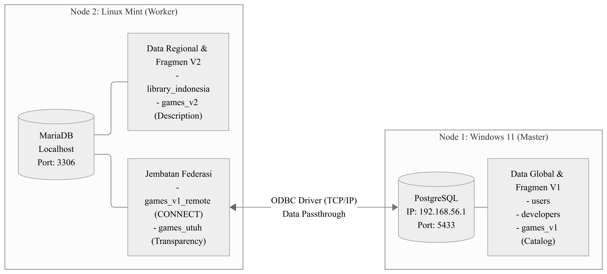
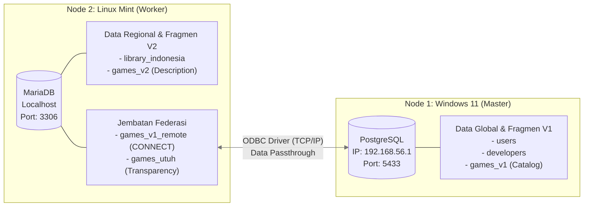

# DiGaDi (Distributed Game Distribution)

Building a heterogeneous distributed database architecture (PostgreSQL & MariaDB) across multiple operating systems. Implementing vertical and horizontal fragmentation alongside real-time fragmentation transparency purely at the database level using the MariaDB CONNECT Engine (ODBC), resulting in an efficient federated data system without burdening the application layer.


## Key Architectural Features
1. **Heterogeneous Distributed System:** Integrating two different RDBMS engines (PostgreSQL and MariaDB) running on two distinct Operating Systems.
2. **Vertical Fragmentation:** Separating heavy columns (game description text) to a local node to conserve the main server's I/O.
3. **Derived Horizontal Fragmentation:** Partitioning transaction table rows (*library* and *wishlists*) based on region/country (*user country*).
4. **Pure Database-Level Fragmentation Transparency:** The application queries a single, unified table (`games_utuh`) without needing to know that a Cross-Node JOIN via the ODBC protocol is occurring behind the scenes.

## System Topology & Architecture




## Repository Structure

```text
DiGaDi-Distributed-Database/
├── node1-postgresql/
│   ├── node1_schema.sql      # Master DDL (Global Tables & V1 Fragments)
│   └── node1_seed.sql        # Global System Dummy Data
├── node2-mariadb/
│   ├── node2_schema.sql      # Local DDL, CONNECT Tables (Bridge), & Federated Tables
│   └── node2_seed.sql        # Linux Regional Physical Dummy Data
└── README.md
```

## Installation Guide (Reproducibility)

### 1. Node 1 Configuration (Windows 11)
- Ensure PostgreSQL is running on the Windows machine (using port `5433` in this test environment).
- Execute the `node1_schema.sql` file to build the table structures and sequences.
- Execute the `node1_seed.sql` file to insert the initial data.
- Configure the `pg_hba.conf` and `postgresql.conf` files to allow PostgreSQL to accept connections from the Node 2 VM or network IP address.

### 2. Node 2 Configuration (Linux Mint)
- Ensure MariaDB is running and the `psqlODBC` driver (PostgreSQL ODBC driver for Linux) is installed on the system.
- Modify the `/etc/odbc.ini` configuration file on the Linux OS so the Data Source Name (DSN) points to the Windows PostgreSQL IP (`192.168.56.1:5433`).
- Log into the MariaDB command-line interface as `root` and create a dedicated user to bypass `unix_socket` restrictions in loopback connections:
  ```sql
  CREATE USER IF NOT EXISTS 'penghubung'@'127.0.0.1' IDENTIFIED BY 'buka_pintu';
  GRANT ALL PRIVILEGES ON digadi_node2.* TO 'penghubung'@'127.0.0.1';
  FLUSH PRIVILEGES;
  ```
- Execute `node2_schema.sql` to establish the federation bridge and local physical tables.
- Execute `node2_seed.sql` to inject the regional transaction data.

## Fragmentation Transparency Proof

Once the installation is complete, the transparency system and cross-platform synchronization can be tested directly from the Node 2 terminal (MariaDB on Linux Mint).

**Inspecting the Query Execution Plan:**
Running the `EXPLAIN` command proves that the MariaDB engine takes on the orchestration role; pulling queries from PostgreSQL via the `games_v1_remote` bridge and joining them with the local `games_v2` fragment.
```sql
EXPLAIN SELECT * FROM games_utuh;
```

**Proving Real-Time Data Integration:**
Frontend data can be retrieved logically using a single, simple `SELECT` query on the federated table without needing to know the physical location of the data fragments.
```sql
SELECT title, price, description FROM games_utuh WHERE game_id = 1;
```
*(Any mutation operation, such as updating the `price` value in the Node 1 Windows environment, will instantly reflect when querying `games_utuh` in Node 2 Linux).*